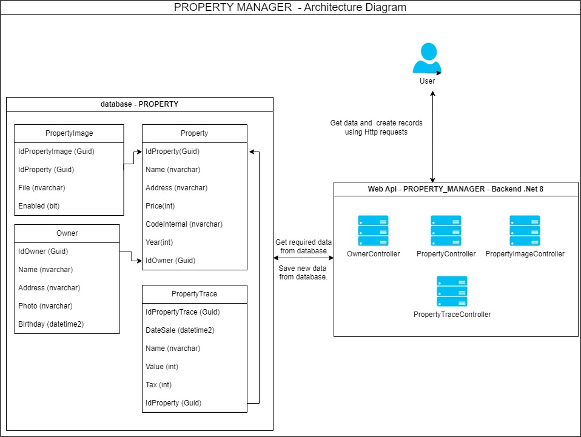
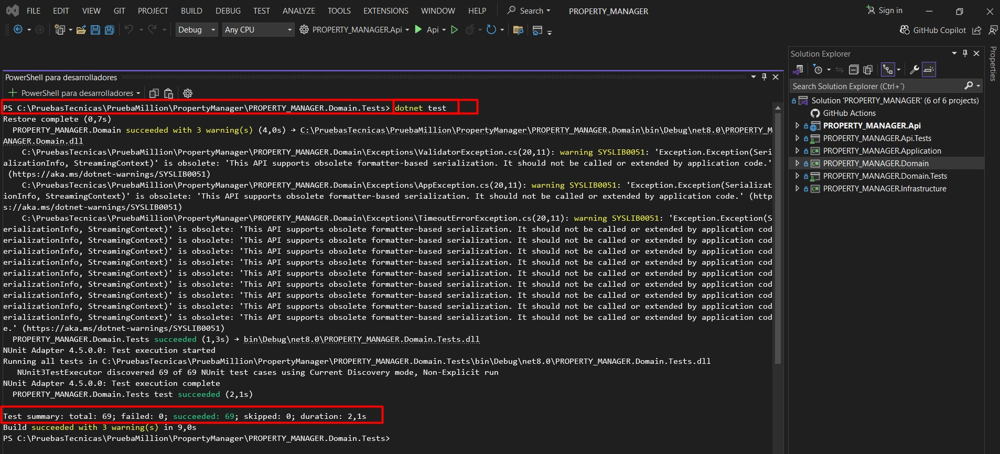
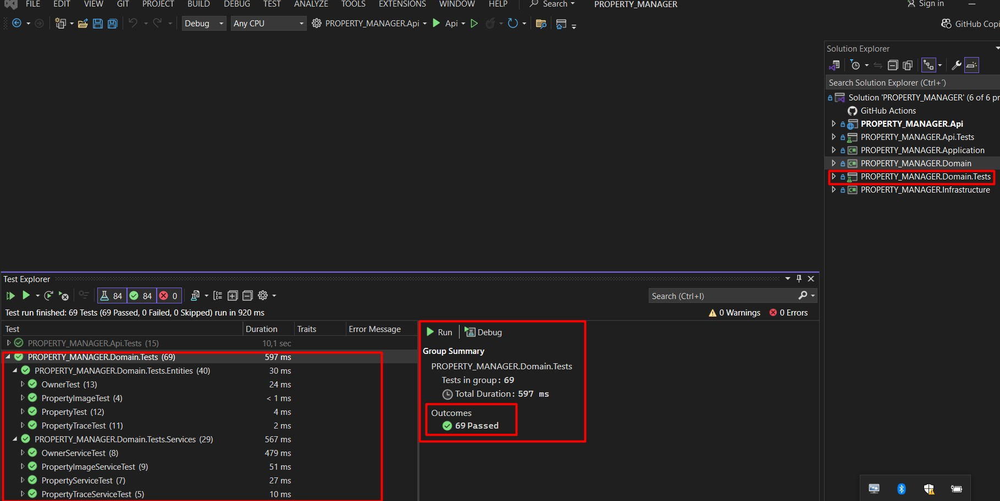
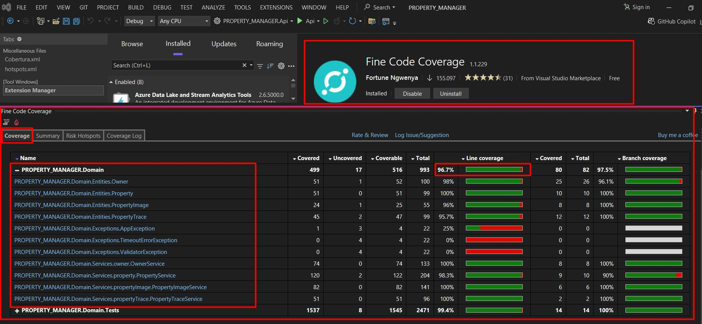
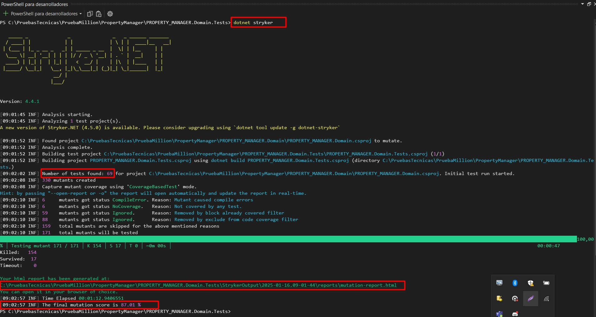
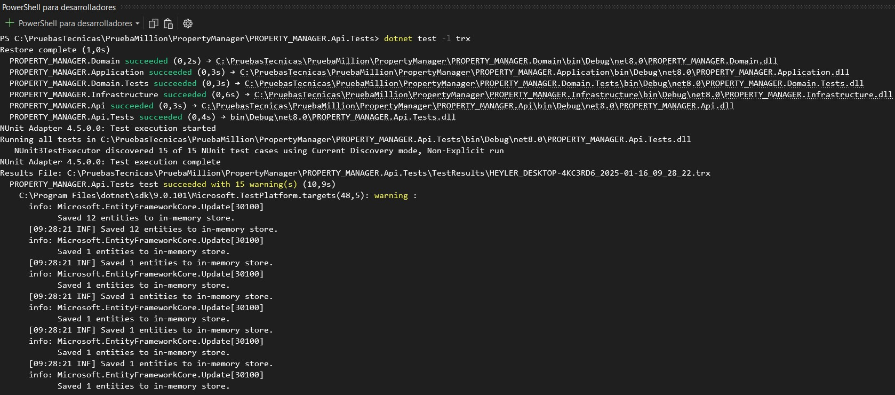
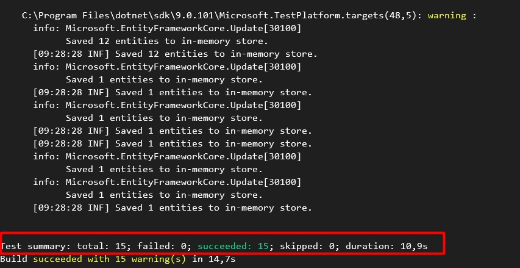
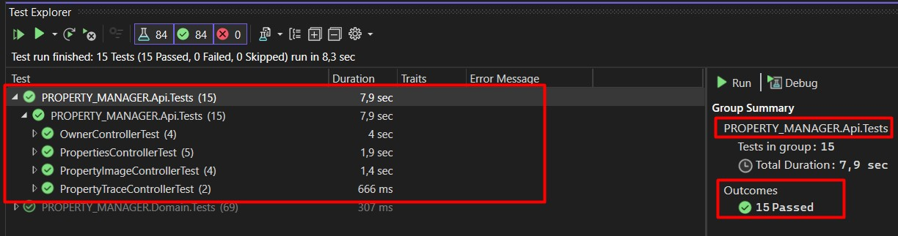
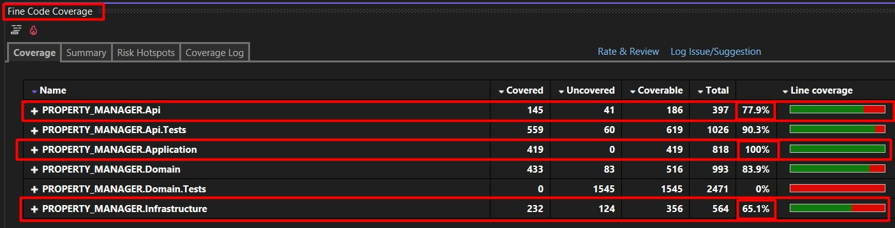
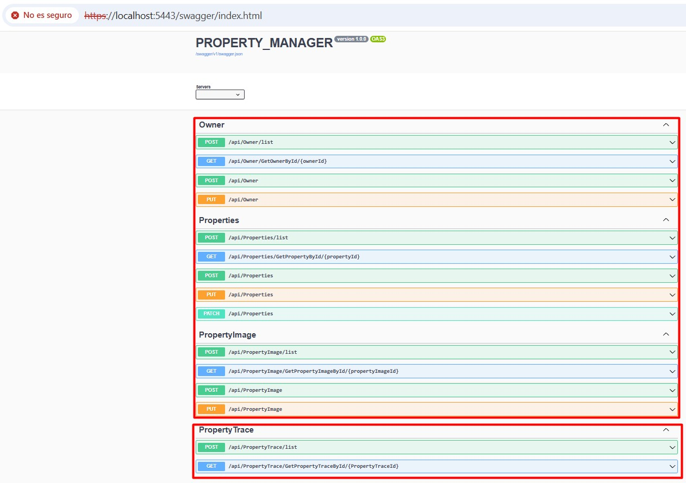

# PropertyManager

## Descripción General

Este documento proporciona una visión general del desarrollo realizado en el **BackEnd** del "Property Manager".

A continuación, se detallan las consideraciones necesarias para poner en funcionamiento la aplicación, incluyendo los pasos para configurar el entorno. Finalmente, se explica cómo ejecutar las diferentes pruebas (unitarias, de integración y de mutación) y cómo ver los resultados de la cobertura de las pruebas realizadas.

## Descripción BackEnd

El **BackEnd** se construyó usando **.NET 8**, aplicando la **arquitectura hexagonal** o de puertos y adaptadores, junto con **CQRS** (Command Query Responsibility Segregation) para separar responsabilidades entre consultas (Queries) y operaciones (Commands).

### Capas del BackEnd

- **API**: Contiene los controladores y endpoints de la aplicación.
- **Api.Tests**: En esta capa se encuentran todas las pruebas de integración, realizadas a la capa de Api.
- **Application**: Orquesta los servicios de dominio como Commands, Queries y Handlers.
- **Infrastructure**: Implementaciones concretas de los adaptadores, comunicación con tecnologías externas y persistencia de datos.
- **Domain**: Lógica de negocio, incluyendo entidades, objetos de valor, reglas de negocio, puertos, comandos y consultas.
- **Domain.Tests**: Contiene las pruebas unitarias de la capa de dominio.

### Patrones de Diseño Utilizados

- **Inyección de dependencias**
- **Patrón AAA (Arrange, Act, Assert)**
- **Patrón Builder**
- **CQRS**
- **Decoradores**
- **DTO (Data Transfer Object)**

---

### Descripción BackEnd

Para correr el **BackEnd** en **.NET 8**, sigue estos pasos:

1. **Instalar el .NET 8 SDK** desde [aquí](https://dotnet.microsoft.com/es-es/download).
2. Tener una instancia de **SQL Server** con un usuario con permisos suficientes para crear bases de datos, por ejemplo un usuario con el rol sysadmin.
3. **Clonar el repositorio.**
4. Edita el archivo `appsettings.json` ubicado en la carpeta `PROPERTY_MANAGER.Api` para ajustar la cadena de conexión a SQL Server:

    ```json
    "StringConnection": "Server=localhost\\SQLEXPRESS;Database=Property;User Id=hsmo;Password=12345;TrustServerCertificate=True"
    ```

5. Ejecuta las migraciones de **Entity Framework** para crear la base de datos:

    a) Instala el CLI de **EF Core**:
    ```bash
    dotnet tool install --global dotnet-ef
    ```

    b) Crea la migración desde la carpeta `PROPERTY_MANAGER.Infrastructure`:
    ```bash
    dotnet ef migrations add Inicial --startup-project ..\PROPERTY_MANAGER.Api\PROPERTY_MANAGER.Api.csproj
    ```

    c) Aplica la migración y crea la base de datos:
    ```bash
    dotnet ef database update -s ..\PROPERTY_MANAGER.Api\PROPERTY_MANAGER.Api.csproj
    ```
    d)  La migración aplicada incluye el esquema de la base de datos con las relaciones definidas entre las tablas. Además, contiene datos semilla que proporcionan información inicial, como usuarios propietarios predeterminados de la aplicación, propiedades,imagenes asociadas a una propiedad y una traza de los cambios realizados a una propiedad.
    
    El sistema está diseñado para permitir la creación, edición y consulta de usuarios propietarios, propiedades e imagenes asociadas a las propiedades.

6. Ejecuta la aplicación con el siguiente comando desde la raíz del proyecto:
    ```bash
    dotnet run --project .\PROPERTY_MANAGER.Api\PROPERTY_MANAGER.Api.csproj
    ```

    La aplicación estará disponible en el puerto `5443`.

7. Abre el navegador y valida la documentación de la API en **Swagger**:
    ```bash
    https://localhost:5443/swagger/index.html
    ```
--- 

Con lo anterior ya deberia de poder ver la aplicacion funcionando correctamente.

Como datos adicionales, a continuacion se muestra un diagrama de la arquitectura usada para desarrollar la aplicacion y la documentacion de la api que se genera con swagger.




[ver documentación de la api con swagger](./FilesForTheReadme/DocumentationWithSwaggerWebApi/DocumentationWithSwagger.json)

---

## Pasos para ejecutar y ver resultados de las diferentes pruebas


---

### Descripción BackEnd

---

#### Pruebas unitarias

Este tipo de pruebas (unitarias) verifican de forma aislada el funcionamiento correcto de las unidades más pequeñas del código, como funciones o métodos en la capa de negocio, donde se encuentra la logica o reglas de negocio de la aplicación, en este caso la capa "Domain", asegurando que cumplan con su propósito esperado.

para ejecutar las pruebas se debe ubicar en la ruta `PROPERTY_MANAGER.Domain.Tests` y ejecutar el siguiente comando:

```bash
    dotnet test
```

Al final de ejecutar el comando se muestra un resumen de cuantas pruebas se ejecutaron y su estado. Tal como se muestra a continuación



Otra opción para ejecutar las pruebas es usando el `Test Explorer` que proporciona el IDE `Visual Studio`, el cual permite correr todas las pruebas del dominio o una en especifico.



Existe una extensión que se puede instalar en el IDE `visual Studio` llamado `Fine Code Coverage`, el cual nos permite visualizar el porcentaje de cobertura de pruebas que tiene nuestra capa de dominio.

En el caso de esta aplicaón se puede observar que la cobertura esta por encima del `80%`




---

#### Pruebas de mutación

Este tipo de pruebas evalúan la calidad de las pruebas unitarias existentes modificando deliberadamente el código fuente (introduciendo "mutantes") y verificando si las pruebas detectan estos cambios. Si las pruebas no fallan con los mutantes, indica que podrían ser insuficientes o ineficaces.

para ejecutar las pruebas se debe ubicar en la ruta `PROPERTY_MANAGER.Domain.Tests` y ejecutar el siguiente comando:


```bash
    dotnet stryker
```

En caso de no tener instalada la herramienta de stryker, lo puede instalar con el siguiente comando:

```bash
    dotnet tool install --global dotnet-stryker
```

Al final de ejecutar las pruebas de mutación, se muestra el porcentaje de cobertura de pruebas de mutacion y se genera un informe html con el resultado de dichas pruebas.

Para el caso de esta aplicación el porcentaje de cobertura de pruebas de mutación esta por encima del 80%. Tal como se muestra a continuación:




Se adjunta informe generado al correr las mutation test

[ver resultado del informe generado de mutation test](https://heylermontoya.github.io/PropertyManager/FilesForTheReadme/MutationTestResults/mutation-report.html)

---

#### Pruebas de integración

Este tipo de pruebas verifican que los módulos o componentes interactúen correctamente entre sí, asegurando que las dependencias, como bases de datos, APIs externas o servicios, funcionen de manera conjunta como se espera.

Para el caso de esta aplicación, para ejecutar las pruebas de integración se uso una base de datos en memoria, para asi, probar la interación entre las diferentes capas de la aplicación.

para ejecutar las pruebas se debe ubicar en la ruta `PROPERTY_MANAGER.Api.Tests` y ejecutar el siguiente comando:


```bash
    dotnet test
```

Al final de ejecutar el comando se muestra un resumen de cuantas pruebas se ejecutaron y su estado. Tal como se muestra a continuación:





Otra opción para ejecutar las pruebas es usando el `Test Explorer` que proporciona el IDE `Visual Studio`, el cual permite correr todas las pruebas de integración o una en especifico.



Existe una extensión que se puede instalar en el IDE `visual Studio` llamado `Fine Code Coverage`, el cual nos permite visualizar el porcentaje de cobertura de pruebas que tiene la capa de Api, Application e infrastructure. Se nombran todas las capas del proyecto, debido a que las pruebas de integración, prueban la integracion entre las diferentes capas del proyecto.

En el caso de esta aplicaón se puede observar que la cobertura esta por encima del `65%` en todas las capas.



Para las pruebas de integración, se uso una base de datos en memoria, para NO usar la base de datos real.

Una base de datos en memoria es una caracteristica que brinda entity Framework.

---

## Descripción funcionamiento de la api desde Swagger y reglas de negocio implementadas en la aplicación construida.

Para el funcionamiento de la aplicacion, se construyeron 4 controladores, tal como se muestra en el diagrama de la arquitectura. Los controladores tienen diferentes End points los cuales se describiran a continuación y ademas se van mostrando las reglas de negocio que se fueron implementando.





### Controlador `Owner`

#### Post `api/Owner/list`

Permite consultar la lista de todos los Owners creados en la base de datos y adicional, se pueden implementar filtros y ordenamientos por cualquier campo de la entidad Owner.

#### get `/api/Owner/GetOwnerById/{ownerId}`

Obtiene la información de un propietario (Owner) especificando su ID. El propietario debe existir previamente en la base de datos. Si se consulta un ID que no está registrado, se retornará un error controlado indicando que el propietario no existe en la base de datos.

#### Post `/api/Owner`

Este endpoint permite crear un propietario (Owner) proporcionando los datos básicos requeridos. Se aplican las siguientes validaciones:

Nombre (Name):

- El nombre no debe repetirse en la base de datos.
- Debe tener al menos 3 caracteres.

Dirección (Address):

- La dirección no debe repetirse en la base de datos.
- Debe tener al menos 6 caracteres.

Foto (Photo):

- Este campo es obligatorio y no puede estar vacío.
- Debe contener una URL válida.
- Solo se permiten los formatos de imagen .png y .jpeg.

Fecha de nacimiento (Birthday):

- No puede ser una fecha futura.
- El propietario debe tener al menos 18 años de edad.
- La edad no debe exceder los 100 años.

Si alguna de estas validaciones no se cumple, se retornará un error controlado con el detalle correspondiente.

#### Put `/api/Owner`

Este endpoint permite editar un propietario (Owner) proporcionando los datos básicos requeridos. Se aplican las mismas validaciones que en la creación de un propietario, con la siguiente validación adicional:

- El propietario a editar debe existir previamente en la base de datos. Si el ID especificado no corresponde a un registro existente, se retornará un error controlado indicando que el propietario no fue encontrado.

### Controlador `Properties`

#### Post `api/Properties/list`

Permite consultar la lista de todas las Propiedades (Properties) creados en la base de datos y adicional, se pueden implementar filtros y ordenamientos por cualquier campo de la entidad Property.

#### get `/api/Properties/GetPropertyById/{propertyId}`

Obtiene la información de una propiedad (Property) especificando su ID. La propiedad debe existir previamente en la base de datos. Si se consulta un ID que no está registrado, se retornará un error controlado indicando que la propiedad no existe en la base de datos.

#### Post `/api/Properties`

Este endpoint permite crear una propiedad (Property) proporcionando los datos básicos requeridos. Se aplican las siguientes validaciones:

Nombre (Name):

- Debe ser único en la base de datos.
- Debe contener al menos 3 caracteres.

Dirección (Address):

- Debe ser única en la base de datos.
- Debe contener al menos 6 caracteres.

Precio (Price):

- Debe ser mayor que cero.

Código Interno (CodeInternal):

- Debe ser único en la base de datos.
- Debe contener al menos 4 caracteres.

Año (Year):

- No puede ser anterior al año 1900.

ID del Propietario (IdOwner):

- Debe corresponder a un propietario (Owner) existente en la base de datos.

Si alguna de estas validaciones no se cumple, se retornará un error controlado con el detalle del problema.

Además de crear la propiedad, este endpoint genera automáticamente un registro de traza asociado en la entidad PropertyTrace, proporcionando un historial inicial para la nueva propiedad.

#### Put `/api/Properties`

Este endpoint permite editar una propiedad (Property) proporcionando los datos básicos requeridos. Se aplican las mismas validaciones que en la creación de una propiedad, con la siguiente validación adicional:

- La propiedad a editar debe existir previamente en la base de datos. Si el ID especificado no corresponde a un registro existente, se retornará un error controlado indicando que la propiedad no fue encontrado.

Además de actualizar la propiedad, este endpoint crea automáticamente un registro de traza en la entidad PropertyTrace. Esto permite mantener un historial detallado de los cambios realizados, asegurando un seguimiento adecuado de las modificaciones en la propiedad.

#### Patch `/api/Properties`

Este endpoint permite actualizar únicamente el campo de precio (Price) de una propiedad (Property). Se aplican las siguientes validaciones:

Precio (Price):

- Debe cumplir con las mismas reglas definidas en la creación de una propiedad:
  - El precio no puede ser menor o igual a cero.

- La propiedad a editar debe existir previamente en la base de datos. Si el ID especificado no corresponde a una propiedad registrada, se retornará un error controlado indicando que la propiedad no fue encontrada.

Este endpoint está diseñado para realizar cambios específicos y rápidos en el precio de una propiedad, garantizando la integridad de los datos mediante las validaciones aplicadas.

Además de actualizar el precio de la propiedad, este endpoint crea automáticamente un registro de traza en la entidad PropertyTrace. Esto permite mantener un historial detallado de los cambios realizados, asegurando un seguimiento adecuado de las modificaciones en la propiedad.


### Controlador `PropertyImage`

#### Post `api/PropertyImage/list`

Permite consultar la lista de todas las imagenes asociadas a las propiedades (PropertyImage) creados en la base de datos y adicional, se pueden implementar filtros y ordenamientos por cualquier campo de la entidad PropertyImage.

#### get `/api/PropertyImage/GetPropertyImageById/{propertyImageId}`

Obtiene la información de una imagen asociada a una propiedad (propertyImage) especificando su ID. La imagen asociada a una propiedad debe existir previamente en la base de datos. Si se consulta un ID que no está registrado, se retornará un error controlado indicando que la imagen asociada a una propiedad no existe en la base de datos.

#### Post `/api/PropertyImage`

Este endpoint permite crear un registro de una imagen asociada a una propiedad (PropertyImage) proporcionando los datos básicos requeridos. Las validaciones aplicadas son las siguientes:

ID de la propiedad (IdProperty):

- Debe corresponder a una propiedad existente en la base de datos. Si el ID no corresponde a una propiedad registrada, se retornará un error controlado.

Archivo (File):

- Este campo es obligatorio y no puede estar vacío.
- Solo se permiten archivos con los formatos de imagen .png, .jpg y .jpeg.

Número máximo de archivos por propiedad:

- En el archivo de configuración de la aplicación (appsettings.json), se define un límite máximo de imágenes permitidas por propiedad, configurado con un valor de 3. Si se intenta agregar más imágenes de las permitidas, se retornará un error controlado indicando que se ha superado el límite.

Si alguna de estas validaciones no se cumple, el sistema devolverá un error controlado con el detalle del problema encontrado.

#### Put `/api/PropertyImage`


Este endpoint permite actualizar un registro de imagen asociado a una propiedad (PropertyImage) proporcionando los datos básicos requeridos. Se aplican las mismas validaciones definidas para la creación de registros (PropertyImage), con la siguiente validación adicional:

- El registro de imagen asociado a la propiedad debe existir previamente en la base de datos. Si el ID especificado no corresponde a un registro existente, se retornará un error controlado indicando que el registro no fue encontrado.

### Controlador `PropertyTrace`

#### Post `api/PropertyTrace/list`


Permite consultar la lista de todos los registros asociados a la traza de las propiedades (PropertyTrace) creados en la base de datos y adicional, se pueden implementar filtros y ordenamientos por cualquier campo de la entidad PropertyTrace.

#### get `/api/PropertyTrace/GetPropertyTraceById/{PropertyTraceId}`

Obtiene la información de un registro especifico de la traza de una propiedad (PropertyTrace) especificando su ID. El registro especifico de la traza de la propiedad debe existir previamente en la base de datos. Si se consulta un ID que no está registrado, se retornará un error controlado indicando que el registro no existe en la base de datos.
