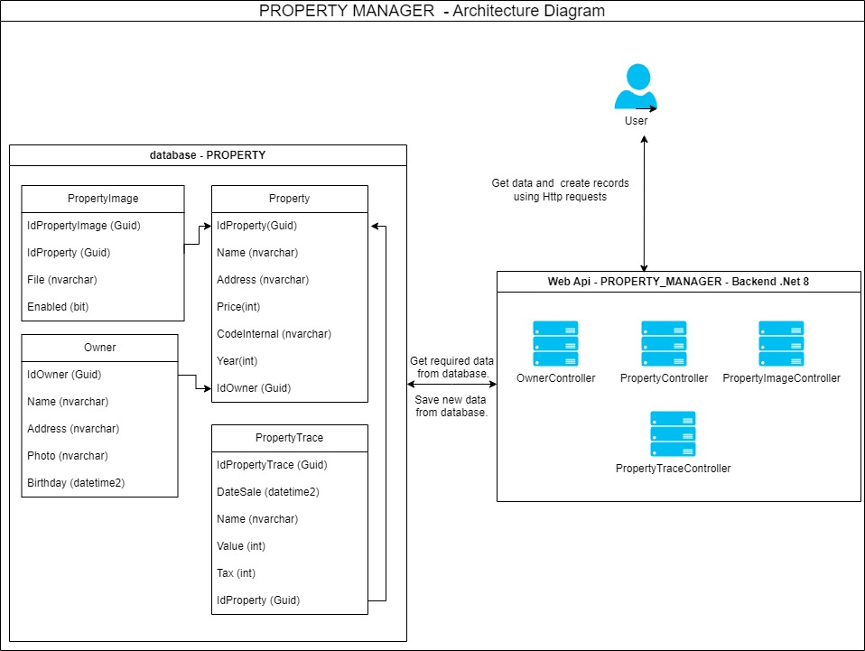

# PropertyManager

## Descripción General

Este documento proporciona una visión general del desarrollo realizado en el **BackEnd** del "Property Manager".

A continuación, se detallan las consideraciones necesarias para poner en funcionamiento la aplicación, incluyendo los pasos para configurar el entorno. Finalmente, se explica cómo ejecutar las diferentes pruebas (unitarias, de integración y de mutación) y cómo ver los resultados de la cobertura de las pruebas realizadas.

## Descripción BackEnd

El **BackEnd** se construyó usando **.NET 8**, aplicando la **arquitectura hexagonal** o de puertos y adaptadores, junto con **CQRS** (Command Query Responsibility Segregation) para separar responsabilidades entre consultas (Queries) y operaciones (Commands).

### Capas del BackEnd

- **API**: Contiene los controladores y endpoints de la aplicación.
- **Api.Tests**: En esta capa se encuentran todas las pruebas de integración, realizadas a la capa de Api.
- **Application**: Orquesta los servicios de dominio como Commands, Queries y Handlers.
- **Infrastructure**: Implementaciones concretas de los adaptadores, comunicación con tecnologías externas y persistencia de datos.
- **Domain**: Lógica de negocio, incluyendo entidades, objetos de valor, reglas de negocio, puertos, comandos y consultas.
- **Domain.Tests**: Contiene las pruebas unitarias de la capa de dominio.

### Patrones de Diseño Utilizados

- **Inyección de dependencias**
- **Patrón AAA (Arrange, Act, Assert)**
- **Patrón Builder**
- **CQRS**
- **Decoradores**
- **DTO (Data Transfer Object)**

---

### Descripción BackEnd

Para correr el **BackEnd** en **.NET 8**, sigue estos pasos:

1. **Instalar el .NET 8 SDK** desde [aquí](https://dotnet.microsoft.com/es-es/download).
2. Tener una instancia de **SQL Server** con un usuario con permisos suficientes para crear bases de datos, por ejemplo un usuario con el rol sysadmin.
3. **Clonar el repositorio.**
4. Edita el archivo `appsettings.json` ubicado en la carpeta `PROPERTY_MANAGER.Api` para ajustar la cadena de conexión a SQL Server:

    ```json
    "StringConnection": "Server=localhost\\SQLEXPRESS;Database=Property;User Id=hsmo;Password=12345;TrustServerCertificate=True"
    ```

5. Ejecuta las migraciones de **Entity Framework** para crear la base de datos:

    a) Instala el CLI de **EF Core**:
    ```bash
    dotnet tool install --global dotnet-ef
    ```

    b) Crea la migración desde la carpeta `PROPERTY_MANAGER.Infrastructure`:
    ```bash
    dotnet ef migrations add Inicial --startup-project ..\PROPERTY_MANAGER.Api\PROPERTY_MANAGER.Api.csproj
    ```

    c) Aplica la migración y crea la base de datos:
    ```bash
    dotnet ef database update -s ..\PROPERTY_MANAGER.Api\PROPERTY_MANAGER.Api.csproj
    ```
    d)  La migración aplicada incluye el esquema de la base de datos con las relaciones definidas entre las tablas. Además, contiene datos semilla que proporcionan información inicial, como usuarios propietarios predeterminados de la aplicación, propiedades,imagenes asociadas a una propiedad y una traza de los cambios realizados a una propiedad.
    
    El sistema está diseñado para permitir la creación, edición y consulta de usuarios propietarios, propiedades e imagenes asociadas a las propiedades.

6. Ejecuta la aplicación con el siguiente comando desde la raíz del proyecto:
    ```bash
    dotnet run --project .\PROPERTY_MANAGER.Api\PROPERTY_MANAGER.Api.csproj
    ```

    La aplicación estará disponible en el puerto `5443`.

7. Abre el navegador y valida la documentación de la API en **Swagger**:
    ```bash
    https://localhost:5443/swagger/index.html
    ```
--- 

Con lo anterior ya deberia de poder ver la aplicacion funcionando correctamente.

Como datos adicionales, a continuacion se muestra un diagrama de la arquitectura usada para desarrollar la aplicacion y la documentacion de la api que se genera con swagger.




[ver documentación de la api con swagger](./DocumentationWithSwaggerWebApi/DocumentationWithSwagger.json)

---

## Pasos para ejecutar y ver resultados de las diferentes pruebas

---

### Descripción BackEnd

---

#### Pruebas unitarias

Este tipo de pruebas (unitarias) verifican de forma aislada el funcionamiento correcto de las unidades más pequeñas del código, como funciones o métodos en la capa de negocio, donde se encuentra la logica o reglas de negocio de la aplicación, en este caso la capa "Domain", asegurando que cumplan con su propósito esperado.

para ejecutar las pruebas se debe ubicar en la ruta `PROPERTY_MANAGER.Domain.Tests` y ejecutar el siguiente comando:

```bash
    dotnet test
```

Al final de ejecutar el comando se muestra un resumen de cuantas pruebas se ejecutaron y su estado.

---

#### Pruebas de mutación

Este tipo de pruebas evalúan la calidad de las pruebas unitarias existentes modificando deliberadamente el código fuente (introduciendo "mutantes") y verificando si las pruebas detectan estos cambios. Si las pruebas no fallan con los mutantes, indica que podrían ser insuficientes o ineficaces.

para ejecutar las pruebas se debe ubicar en la ruta `PROPERTY_MANAGER.Domain.Tests` y ejecutar el siguiente comando:


```bash
    dotnet stryker
```

En caso de no tener instalada la herramienta de stryker, lo puede instalar con el siguiente comando:

```bash
    dotnet tool install --global dotnet-stryker
```

Al final de ejecutar las pruebas de mutación, se muestra el porcentaje de cobertura de pruebas de mutacion y se genera un informe html con el resultado de dichas pruebas.

Para el caso de esta aplicación el porcentaje de cobertura de pruebas de mutación esta por encima del 80%

---

#### Pruebas de integración

Este tipo de pruebas verifican que los módulos o componentes interactúen correctamente entre sí, asegurando que las dependencias, como bases de datos, APIs externas o servicios, funcionen de manera conjunta como se espera.

Para el caso de esta aplicación, para ejecutar las pruebas de integración se uso una base de datos en memoria, para asi, probar la interación entre las diferentes capas de la aplicación.

para ejecutar las pruebas se debe ubicar en la ruta `PROPERTY_MANAGER.Api.Tests` y ejecutar el siguiente comando:


```bash
    dotnet test
```

Al final de ejecutar el comando se muestra un resumen de cuantas pruebas se ejecutaron y su estado.

---